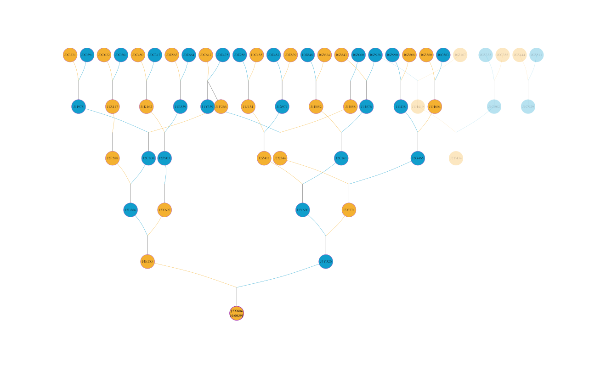

# visPedigree: Tidying, Analysis, and Fast Visualization of Animal and Plant Pedigrees 

`visPedigree` is a comprehensive toolkit for the standardization, statistical analysis, and fast visualization of animal and plant pedigrees. It robustly handles complex mating systems, such as selfing and monoecious reproduction. Using optimized C++ algorithms, the `data.table` framework, and `igraph`, it supports pedigree analysis, relationship matrix calculation, and scalable graph and matrix displays for large pedigrees.

<p align="center">
  
</p>

## Key Features

- **Pedigree Standardization**: Standardizes pedigree records, handles selfing and monoecious reproduction, detects pedigree loops, prepares pedigrees for downstream analysis, and efficiently splits disconnected sub-populations.
- **Comprehensive Pedigree Analysis**: Computes pedigree summaries, equivalent complete generations, generation intervals, effective population size, founder and ancestor contributions, partial inbreeding, relationship matrices, and inbreeding coefficients.
- **High-Throughput Matrix Calculation**: Calculates Additive (A), Dominance (D), and Additive-by-Additive (AA) relationship matrices and their inverses.
- **Advanced Visualization**: Uses `igraph` to generate scalable pedigree graphs, matrix displays, and compact representations for large full-sib families.
- **High Performance**: Uses optimized C++ algorithms together with `data.table` for efficient analysis of large pedigrees.

## Installation

### Stable version from CRAN

```R
install.packages("visPedigree")
```

### Development version from GitHub

```R
# install.packages("devtools")
devtools::install_github("luansheng/visPedigree", build_vignettes = TRUE)
```

## Quick Start

```R
library(visPedigree)

# Example 1: Tidy and visualize a small pedigree
# Use compact = TRUE to condense full-sib groups into a single family node (square) 
# labeled with the group size (e.g., "2"), keeping the graph clean and legible.
cands <- c("Y", "Z1", "Z2")
small_ped |>
  tidyped(cand = cands) |>
  visped(compact = TRUE)

# Example 2: Relationship Matrices (v1.0.0+)
# Compute the additive relationship matrix (A) using high-performance C++ algorithms.
# Use compact = TRUE to accelerate calculation for pedigrees with large full-sib families.
mat_a <- simple_ped |> tidyped() |> pedmat(method = "A", compact = TRUE)
# Visualize the relationship matrix as a heatmap with histograms
vismat(mat_a)

# Example 3: Inbreeding & Highlighting
# Calculate inbreeding coefficients (f) and display them on the graph (e.g., "ID (0.05)").
# Specific individuals can be highlighted to track their inheritance paths.
simple_ped |>
  tidyped(inbreed = TRUE) |>
  visped(highlight = "J5X804", trace = "up", showf = TRUE, compact = TRUE)

# Example 4: Pedigree Analysis (v1.3.4+)
# Summarize pedigree structure
tp <- tidyped(big_family_size_ped)
tp |>
  pedstats(timevar="Year")

# Summarize diversity-related indicators
ref_ind <- tp[Gen == max(Gen), Ind]
tp |>
  pediv(reference = ref_ind)

# Example 5: Pedigree Splitting
# Automatically split the pedigree into independent sub-populations (connected groups).
# Each group is returned as a standalone tidyped object for separate analysis.
split_list <- simple_ped |> tidyped() |> splitped()
summary(split_list[[1]])
```

## Citation

Luan Sheng (2026). visPedigree: Tidying, Analysis, and Fast Visualization of Animal and Plant Pedigrees. R package version 1.3.4, https://github.com/luansheng/visPedigree.
